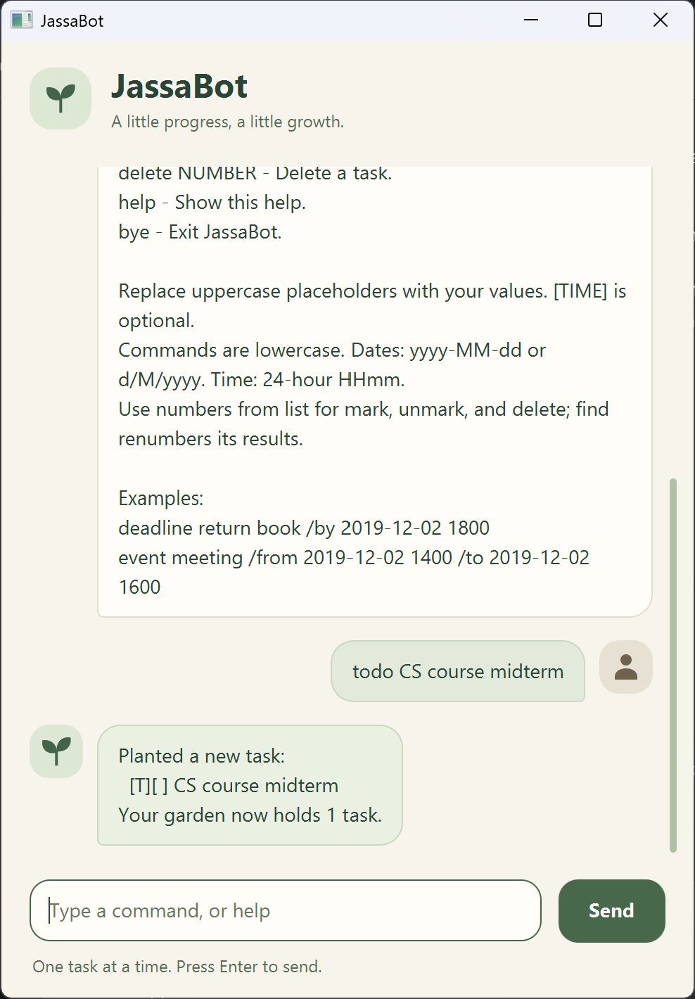

# JassaBot

JassaBot helps you manage tasks, deadlines, and events through simple typed commands.
Its garden-themed chat interface encourages a little progress, one task at a time.



## Quick start

1. Install **Java 25** and check that `java -version` reports version 25.
2. Download `jassabot.jar` from the [latest release](https://github.com/JackyJiangCS/ip/releases/latest).
   Choose the `.jar` file under **Assets** and place it in a folder where you want to keep your tasks.
3. Open a terminal in that folder and run:

   ```sh
   java -jar jassabot.jar
   ```

4. Type `todo read book` and press **Enter** or click **Send**. Try `list`, `mark 1`, or `help` next.

See the [User Guide](https://jackyjiangcs.github.io/ip/) for all commands, examples,
saving behavior, and troubleshooting.

Prefer a terminal interface? Run `java -cp jassabot.jar jassabot.JassaBot` from the same folder.
Both interfaces save tasks to `data/jassabot.txt` relative to the folder you launch from.
Use the same folder each time and run only one JassaBot session at a time.

## Setting up in IntelliJ IDEA

Prerequisite: **JDK 25** and an IntelliJ IDEA version that supports it.

1. Clone this repository to your computer.
2. In IntelliJ IDEA, click **Open** and select the project directory. Allow Gradle to import the project.
3. Set the **Project SDK** and **Gradle JVM** to JDK 25, and set the project language level to
   **SDK default**. See the [IntelliJ SDK instructions](https://www.jetbrains.com/help/idea/sdk.html#set-up-jdk).
4. Run `jassabot.Launcher.main()` to open the GUI, or `jassabot.JassaBot.main()` for the console.
   The greeting starts with `Hello, I'm JassaBot.`.

Keep application code under `src/main/java`; this is the source directory expected by Gradle.

## Running the GUI or console

Use JDK 25 for both interfaces. From the project directory on Windows:

- GUI: `.\gradlew.bat run`, or run `jassabot.Launcher.main()` in IntelliJ IDEA.
- Console: `.\gradlew.bat --console=plain runConsole`, or run `jassabot.JassaBot.main()` in IntelliJ IDEA.
- Build the distributable JAR: `.\gradlew.bat shadowJar`.
- Packaged GUI: `java -jar build/libs/jassabot.jar`.
- Packaged console: `java -cp build/libs/jassabot.jar jassabot.JassaBot`.

On macOS/Linux, use `./gradlew` in place of `.\gradlew.bat`.

Type `help` in either interface to see the command reference.
The `bye` command exits the console immediately; in the GUI it shows a farewell and closes after one second.

## Testing

With JDK 25, run `.\gradlew.bat test checkstyleMain checkstyleTest` on Windows,
or `./gradlew test checkstyleMain checkstyleTest` on macOS/Linux.

For interactive checks, follow the [console UI test plan](test/ui-test-plan.md)
and the [manual GUI test plan](test/manual-test-plan.md).
